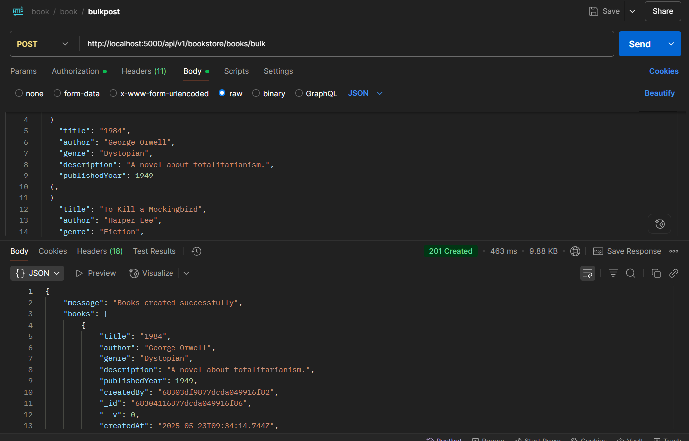
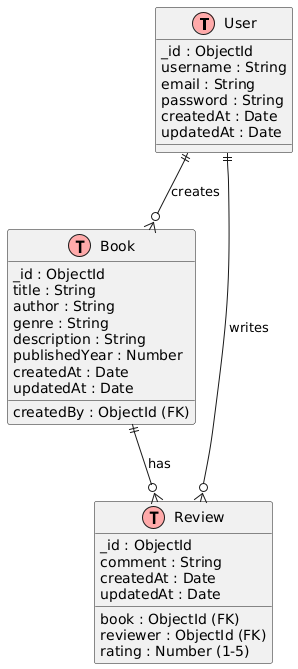

Here's a complete `README.md` template you can use for your project. It includes:

* ✅ Project setup instructions
* ✅ How to run locally
* ✅ Example API requests (with `curl` and Postman-like structure)

---

````markdown
# 📚 Bookstore API

A RESTful API built with Node.js, Express, and MongoDB for managing books, users, and reviews.

---

## 🚀 Features

- User registration and login (JWT auth)
- Book CRUD operations
- Submit and fetch book reviews
- Pagination, filtering (by author/genre)
- Modular code with MongoDB + Mongoose

---

## 🛠️ Project Setup

1. **Clone the repository**
   ```bash
   git clone https://github.com/your-username/bookstore-api.git
   cd bookstore-api
````

2. **Install dependencies**

   ```bash
   npm install
   ```

3. **Create `.env` file in the root**

   ```
   PORT=5000
   MONGO_URI=your_mongodb_connection_string
   JWT_SECRET=your_jwt_secret
   ```

4. **Start the development server**

   ```bash
   npm run dev
   ```

---

## ▶️ Run Locally

Make sure MongoDB is running locally or using Atlas, then:

```bash
npm run dev
```

You should see something like:

```
Server running on http://localhost:5000
MongoDB connected successfully...
```

---

## API requests 

## user collection -> create user 

req -> post http://localhost:5000/api/v1/user/register


## -> login user 

req -> post  http://localhost:5000/api/v1/user/login


## book collection -> create book bulk

req -> post http://localhost:5000/api/v1/bookstore/books/bulk



## -> single book create 

req -> post http://localhost:5000/api/v1/bookstore/books


## get all book with pagination

req -> get http://localhost:5000/api/v1/bookstore/books 


## get book by id 

req -> get http://localhost:5000/api/v1/bookstore/books/68304116877dcda049916f9b


## review added

req -> post http://localhost:5000/api/v1/bookstore/books/68304116877dcda049916f9b/review


## get book by id with review

req -> get http://localhost:5000/api/v1/bookstore/books/68304116877dcda049916f9b


## update review

req -> put http://localhost:5000/api/v1/bookstore/books/68304116877dcda049916f9b/review/6830434a877dcda049916fb8


## delete review

req -> delete http://localhost:5000/api/v1/bookstore/books/68304116877dcda049916f9b/review/6830434a877dcda049916fb8


## ER diagram

